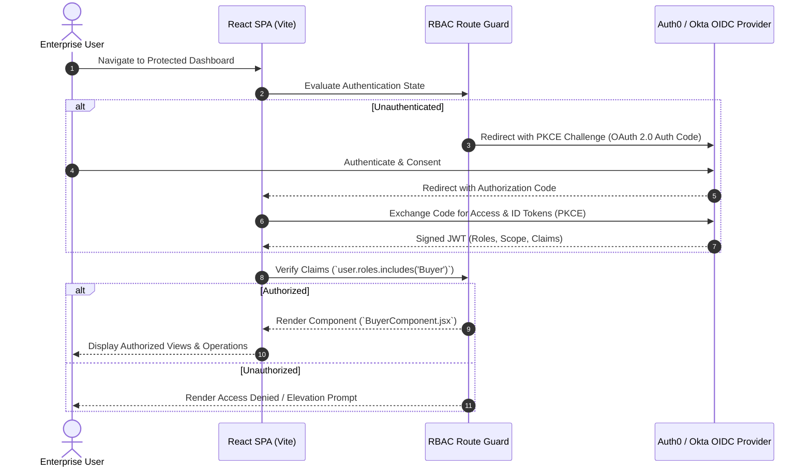

# React-Auth0-PermissionManager: Enterprise RBAC & OAuth 2.0 / OIDC Dashboard

[](https://github.com/ha4kerspidersks/React-Auth0-PermissionManager/actions/workflows/ci.yml)
[](https://opensource.org/licenses/MIT)
[](https://react.dev/)
[](https://auth0.com/)
[](https://tailwindcss.com/)

> **Production reference architecture for enterprise Role-Based Access Control (RBAC), multi-tenant OIDC authorization, and JWT claim policy enforcement in modern React single-page applications.**

---

## 📌 Architectural Overview

Enterprise identity governance requires strict separation of privileges. `React-Auth0-PermissionManager` demonstrates an authenticated, multi-role single-page application integrating **Auth0** and **Okta** identity providers. 

The architecture enforces zero-trust authorization at the client boundary by decoding JWT access tokens, extracting signed role claims, and conditionally rendering protected operational components (e.g. Buyer vs. Seller dashboards).

---

## 🏛️ Authentication & Authorization Flow



---

## 🚀 Quick Start

### 1. Prerequisites
- Node.js 18 or 20+
- npm 9+
- Auth0 Tenant (or Okta Developer account)

### 2. Installation

```bash
# Clone the repository
git clone https://github.com/ha4kerspidersks/React-Auth0-PermissionManager.git
cd React-Auth0-PermissionManager

# Install dependencies
npm ci
```

### 3. Identity Provider Configuration

Create or update `src/auth_config.json`:

```json
{
  "domain": "your-tenant.us.auth0.com",
  "clientId": "yourAuth0ClientId1234567890",
  "audience": "https://api.yourdomain.com/v1"
}
```

### 4. Running the Development Server

```bash
npm run dev
```

### 5. Running the Test Suite

```bash
npm test
```

### 6. Production Build

```bash
npm run build
```

---

## 🛡️ Role-Based Access Control Implementation

### Protected Component Gating Pattern
```jsx
import React from "react";
import { useAuth0 } from "@auth0/auth0-react";
import BuyerComponent from "./Components/BuyerComponent";
import SellerComponent from "./Components/SellerComponent";

export default function Dashboard() {
  const { user, isAuthenticated, isLoading } = useAuth0();

  if (isLoading) return <div>Validating enterprise credentials...</div>;
  if (!isAuthenticated) return <div>Access restricted. Please log in.</div>;

  const roles = user?.["https://yourdomain.com/roles"] || [];

  return (
    <div className="dashboard-container">
      {roles.includes("Buyer") && <BuyerComponent />}
      {roles.includes("Seller") && <SellerComponent />}
    </div>
  );
}
```

---

## 🔒 Security Best Practices

1. **Authorization Code Flow with PKCE:** Replaces legacy implicit flows, eliminating token exposure in browser history and query strings.
2. **Short-Lived Access Tokens:** Leverages ephemeral JWT access tokens combined with Refresh Token Rotation (RTR).
3. **Defense in Depth:** Client-side route guards are paired with downstream API token validation (verifying RS256 signatures, audience, and issuer).

---

## 📄 License
This project is licensed under the [MIT License](LICENSE).
