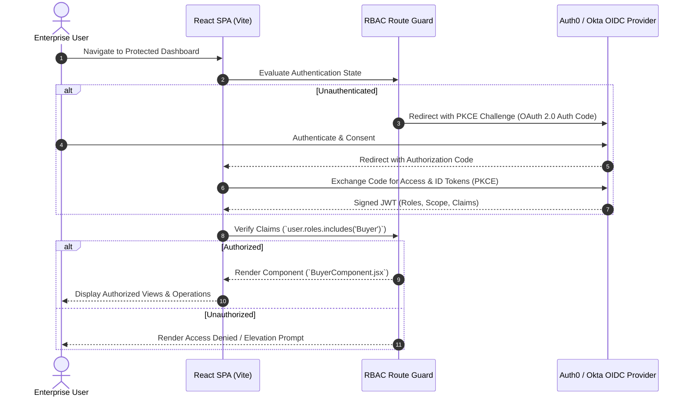

# React-Auth0-PermissionManager: Enterprise RBAC & OAuth 2.0 / OIDC Dashboard

[](https://github.com/ha4kerspidersks/React-Auth0-PermissionManager/actions/workflows/ci.yml)
[](https://opensource.org/licenses/MIT)
[](https://react.dev/)
[](https://auth0.com/)
[](https://tailwindcss.com/)

> **Production reference architecture for enterprise Role-Based Access Control (RBAC), multi-tenant OIDC authorization, and JWT claim policy enforcement in modern React single-page applications.**

---

## 📌 Architectural Overview

Enterprise identity governance requires strict separation of privileges. `React-Auth0-PermissionManager` demonstrates an authenticated, multi-role single-page application integrating **Auth0** and **Okta** identity providers. 

The architecture enforces zero-trust authorization at the client boundary by decoding JWT access tokens, extracting signed role claims, and conditionally rendering protected operational components (e.g. Buyer vs. Seller dashboards).

---

## 🏛️ Authentication & Authorization Flow



---

## 🚀 Quick Start

### 1. Prerequisites
- Node.js 18 or 20+
- npm 9+
- Auth0 Tenant (or Okta Developer account)

### 2. Installation

```bash
# Clone the repository
git clone https://github.com/ha4kerspidersks/React-Auth0-PermissionManager.git
cd React-Auth0-PermissionManager

# Install dependencies
npm ci
```

### 3. Identity Provider Configuration

Create or update `src/auth_config.json`:

```json
{
  "domain": "your-tenant.us.auth0.com",
  "clientId": "yourAuth0ClientId1234567890",
  "audience": "https://api.yourdomain.com/v1"
}
```

### 4. Running the Development Server

```bash
npm run dev
```

### 5. Running the Test Suites

```bash
# Frontend Vitest test suite (9 test cases)
npm test

# Backend RS256 token validation integration test suite (14 test cases)
npm run test:server

# Run all test suites
npm run test:all
```

### 6. Production Build & Server

```bash
# Compile optimized Vite SPA bundle into dist/
npm run build

# Start production Express API server & SPA host
npm run server
```

---

## 🛡️ Role-Based Access Control Implementation

### Protected Component Gating Pattern
```jsx
import React from "react";
import { useAuth0 } from "@auth0/auth0-react";
import BuyerComponent from "./Components/BuyerComponent";
import SellerComponent from "./Components/SellerComponent";

export default function Dashboard() {
  const { user, isAuthenticated, isLoading } = useAuth0();

  if (isLoading) return <div>Validating enterprise credentials...</div>;
  if (!isAuthenticated) return <div>Access restricted. Please log in.</div>;

  const roles = user?.["https://yourdomain.com/roles"] || [];

  return (
    <div className="dashboard-container">
      {roles.includes("Buyer") && <BuyerComponent />}
      {roles.includes("Seller") && <SellerComponent />}
    </div>
  );
}
```

---

## 🔒 Backend Security & Token Validation Model

The Express server (`server/server.js`) enforces defense-in-depth API protection via `server/middleware/jwtAuth.js`:
- **Cryptographic Verification**: Enforces `RS256` asymmetric signatures using Auth0 public keys.
- **Algorithm Attack Prevention**: Explicitly rejects `none`, casing variants (`None`), and symmetric key confusion attacks (`HS256`).
- **Claim Enforcement**: Validates expected `issuer`, `audience`, and expiration timestamps (`exp`, `nbf`).
- **Key ID (kid) Verification**: Supports dynamic keystore key resolution and fails closed on unknown or missing key identifiers.
- **Granular Scope Authorization**: Route-level middleware `requireScope()` verifies required OAuth scopes (`read:spark`, `update:spark`, `manage:all`).
- **Zero Mock Testing**: 37 automated HTTP integration tests validate both acceptance and rejection conditions against ephemeral test keypairs with zero reliance on production credentials.

### API Security & Authorization Matrix

| Endpoint | Method | AuthN Requirement | Required Scope | Success | Unauthorized | Forbidden | Purpose |
|:---|:---:|:---:|:---:|:---:|:---:|:---:|:---|
| `/health` | `GET` | None (Public) | None | `200` | N/A | N/A | Health & Liveness probe |
| `/api1` | `GET` | None (Public) | None | `200` | N/A | N/A | Legacy demonstration endpoint |
| `/api/protected` | `GET` | RS256 Bearer JWT | None | `200` | `401` | N/A | Authenticated identity context |
| `/api/spark/read` | `GET` | RS256 Bearer JWT | `read:spark` | `200` | `401` | `403` | Read access to spark clusters |
| `/api/spark/update` | `POST` | RS256 Bearer JWT | `update:spark` | `200` | `401` | `403` | Update spark cluster settings |
| `/api/spark/admin` | `DELETE` | RS256 Bearer JWT | `manage:all` | `200` | `401` | `403` | Administrative operations |
| `/*` | `GET` | None (Public) | None | `200` | N/A | N/A | Static Vite SPA client fallback |


---

## 🤝 Contributing

Contributions are welcome! Please review:
- [Contributing Guide](.github/CONTRIBUTING.md)
- [Code of Conduct](.github/CODE_OF_CONDUCT.md)
- [Changelog](CHANGELOG.md)

---

## 📄 License
This project is licensed under the [MIT License](LICENSE).
